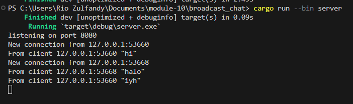
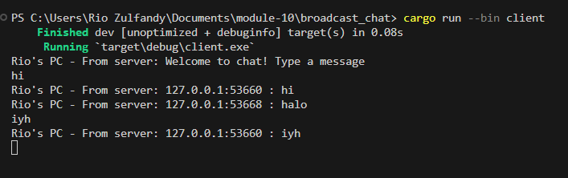
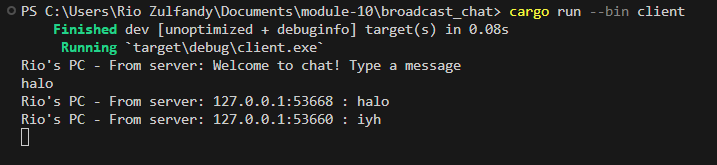

# Tutorial Broadcast chat

## 2.1 Original code, and how it run


Setelah server dimulai menggunakan `cargo run --bin server` dan setiap klien diluncurkan dengan `cargo run --bin client`, output yang ditampilkan menggambarkan bahwa server dan setiap klien menerima siaran obrolan dari setiap klien yang terhubung. Setiap kali klien memasukkan pesan melalui baris perintah, string tersebut dikirim ke server, yang kemudian menyebarkannya ke semua klien yang terhubung.

## 2.2 Modifying port

Untuk mengubah port ke 8080, kita perlu mengubahnya di sisi klien dan server. Pada kode klien kita perlu mengubah URI untuk menggunakan port 8080, bukan 2000. Perubahan ini akan membuat klien terhubung ke port 8080 di localhost. Untuk modifikasi sisi server, kita perlu memastikan bahwa server juga mendengarkan pada port 8080. Ini melibatkan modifikasi kode server tempat server WebSocket diinisialisasi. Dalam kode server, kita harus mencari bagian di mana server WebSocket dibuat dan memastikannya mendengarkan pada port 8080. Ini biasanya melibatkan konfigurasi server untuk mengikat ke alamat dan port yang sesuai. Setelah klien dan server dikonfigurasi untuk menggunakan port 8080, pastikan bahwa konfigurasi firewall atau jaringan apa pun mengizinkan lalu lintas pada port tersebut. Jika konfigurasi port klien tetap tidak berubah sementara port server diubah, hal ini akan mengakibatkan kegagalan koneksi antara klien dan server. Klien akan mencoba membuat koneksi WebSocket ke server pada port 2000, sesuai konfigurasinya. Namun, karena server sekarang mendengarkan pada port 8080, permintaan koneksi dari klien tidak akan sampai ke server. Sebaliknya, ia akan mengalami kesalahan koneksi atau batas waktu habis. Oleh karena itu, sangat penting bagi klien dan server untuk menggunakan port yang sama agar komunikasi berhasil, memastikan bahwa klien dapat mencapai server pada alamat dan port yang ditentukan.

## 2.3 Small changes. Add some information to client





```rust
if let Some(text) = msg.as_text() {
    println!("Rio's PC - From server: {}", text);
}
```

Modifikasi tersebut memastikan bahwa ketika bcast.tx mengirim pesan ke setiap pelanggan, pesan tersebut menyertakan alamat IP pengirim beserta teksnya. Alamat IP pengirim ini diberikan melalui variabel addr.