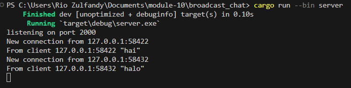
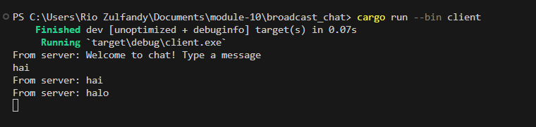
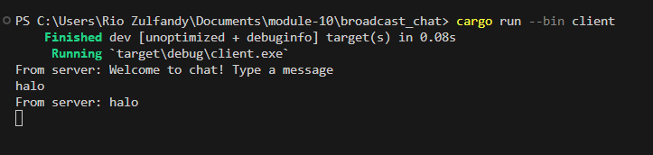

# Tutorial Broadcast chat

## 2.1 Original code, and how it run

Setelah server dimulai menggunakan `cargo run --bin server` dan setiap klien diluncurkan dengan `cargo run --bin client`, output yang ditampilkan menggambarkan bahwa server dan setiap klien menerima siaran obrolan dari setiap klien yang terhubung. Setiap kali klien memasukkan pesan melalui baris perintah, string tersebut dikirim ke server, yang kemudian menyebarkannya ke semua klien yang terhubung.